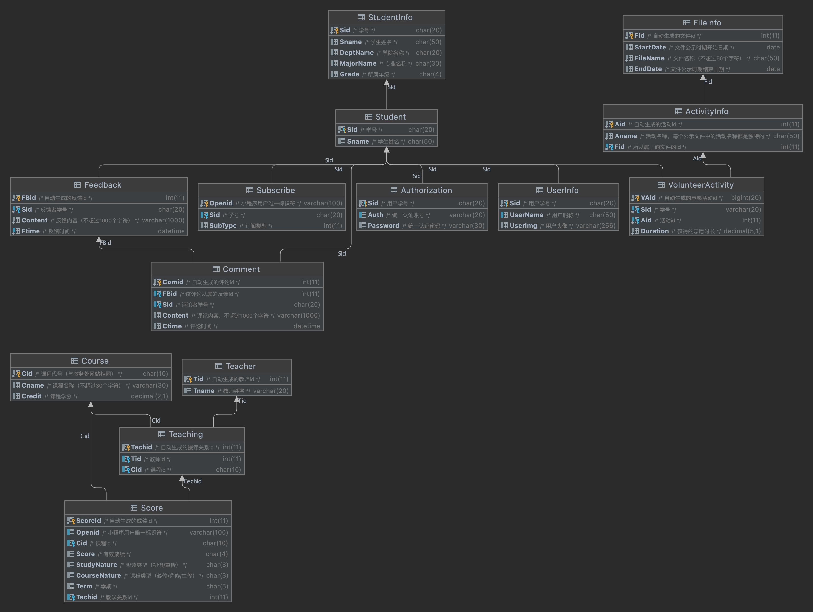

# 321CQUWebsite
321CQU小程序后端部分
重庆大学学生相关信息查询小程序网站后端开源项目

### 项目说明
本项目使用Django框架，除了与网站本身相关的配置被隐去，其余文件均予以保留
其余使用相关库详见requirements.txt

templates文件夹中为api接口调用说明网页，各位可以自行查看

PDFFiles文件夹中为志愿活动相应的文件，本项目示例中未给出

下面为本小程序所使用的数据库表关联图：

我们还有一个封装了pymycqu和selenium+proxy方案查询用户相关信息的类
<https://github.com/ZhuLegend/CQUgetter>

特别鸣谢 Hagb<https://github.com/Hagb>对本项目的大力协助

